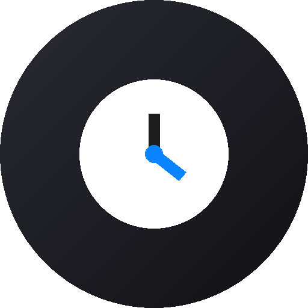
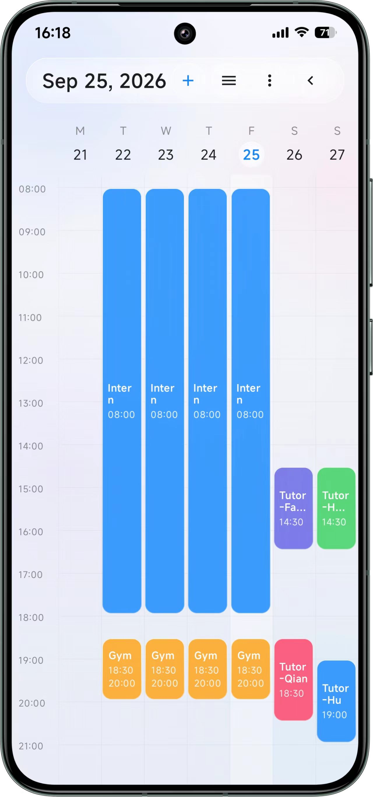
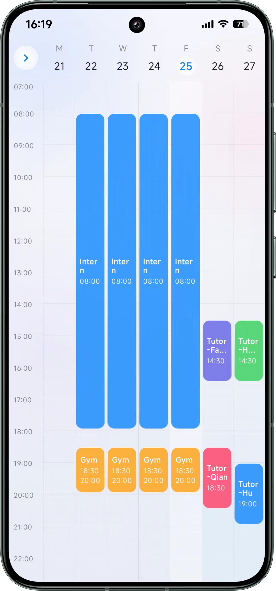
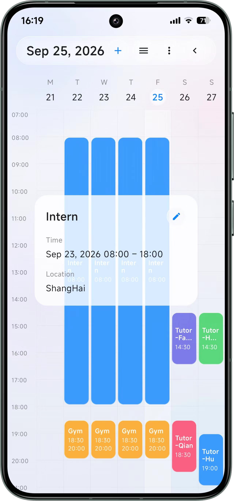
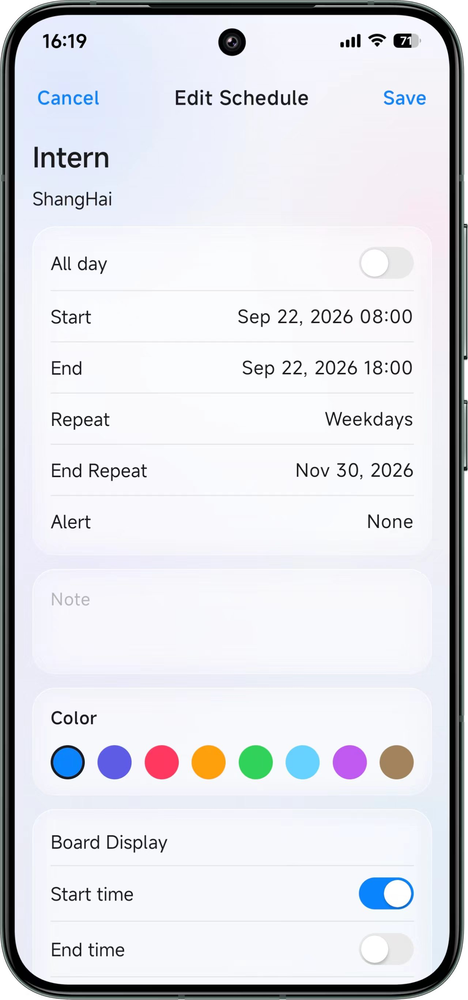
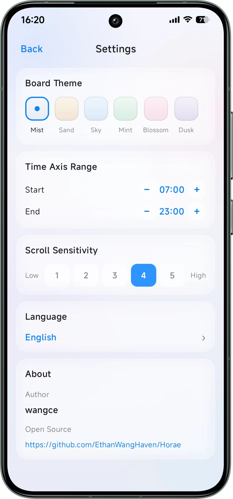

<p align="center">
  
</p>

<h1 align="center">Horae</h1>

<p align="center">
  一款 iOS 液态玻璃风格的 Android 周视图日程看板<br/>
  七列时间网格 · 精确提醒 · 中英双语 · 纯本地离线
</p>

<p align="center">
  
  
  
  
</p>

---

## 简介

Horae 是一款 Android 原生日程看板应用，以 iOS 液态玻璃（Liquid Glass）为视觉基调：壁纸实时模糊 + 高光描边，全应用统一的通透质感。核心是一块**周视图看板**——七天时间网格上直观铺陈每一条日程，配合重复规则、精确到分钟的提醒与全局搜索，让一周安排尽收眼底。

所有数据仅存储在本地（Room 数据库 + SharedPreferences），无网络权限、无账号体系，开箱即用。

## 功能特性

### 看板

- **周视图时间网格**：七列 × 整点横线，日程块按起止时间精确定位，今天列淡高亮
- **重叠分车道**：同一时段的多条日程自动均分车道并排显示，互不遮挡
- **点按即建**：点按网格空白时段直达新建页，自动带入对应日期与开始时间
- **可折叠顶栏**：标题栏可折叠收纳到纵轴交点，折叠 / 展开丝滑过渡动画，状态持久化记忆
- **纵轴范围可调**：时间轴显示范围自由设定（默认 7:00 – 23:00）
- **竖滑灵敏度**：5 挡滚动灵敏度（0.72× – 1.8×），快滑慢滑随你习惯
- **看板条信息自定义**：每条日程可单独选择看板条上显示开始 / 结束时间、地点
- **溢出智能处理**：看板条内容放不下时主动提示，可选"自动适配"或"仍然显示"

### 日程管理

- **完整字段**：标题、地点、备注、全天开关
- **8 色 iOS 柔和色板**：蓝 / 靛 / 粉 / 橙 / 绿 / 青 / 紫 / 棕
- **灵活重复**：不重复 / 每天 / 每周 / 工作日 / 每月 / 自定义（每 N 天、周、月、年）
  - 结束方式三选一：永不、直到某日、限 N 次
- **精确提醒**：准时或提前 N 分钟，基于 AlarmManager 精确闹钟，高优先级通知直达（内容含开始时间与地点）
- **全天日程**：自动归入看板顶部全天区域展示

### 更多

- **全局搜索**：按标题 / 地点 / 备注 模糊搜索全部历史日程
- **日程列表**：以列表形式纵览所有日程
- **6 种看板主题**：晨雾 / 暖沙 / 晴空 / 薄荷 / 樱花 / 暮紫，一键换肤
- **中英双语**：界面语言一键切换，通知渠道名同步跟随

## 界面展示

| 周视图看板 | 折叠顶栏浏览 |
|:---:|:---:|
| <br/><sub>七列时间网格，重叠自动分车道，今天列淡高亮</sub> | <br/><sub>标题栏收纳至纵轴交点，视野更开阔</sub> |

| 日程详情 | 添加 / 编辑日程 |
|:---:|:---:|
| <br/><sub>详情弹窗：时间 / 地点 / 备注 / 提醒一目了然</sub> | <br/><sub>8 色色板、重复规则、提醒与看板条显示设置</sub> |

<p align="center">
  <br/>
  <sub>设置页：看板主题 / 时间轴范围 / 滑动灵敏度 / 界面语言 / 关于</sub>
</p>

## 技术栈

| 类别 | 技术 |
|:---|:---|
| 语言 | Kotlin 2.2 |
| UI | Jetpack Compose · Material 3 |
| 存储 | Room 2.7（本地 SQLite，无网络依赖） |
| 导航 | Navigation Compose，单 Activity 架构 |
| 视觉 | RenderEffect 壁纸实时模糊 + 高光描边（液态玻璃） |
| 提醒 | AlarmManager 精确闹钟 + BroadcastReceiver + 系统通知 |
| 工具链 | AGP 8.13 · KSP · JDK 17 |

**涉及权限**（均为提醒功能所需）：

- `POST_NOTIFICATIONS` —— 发送日程提醒通知
- `SCHEDULE_EXACT_ALARM` —— 精确定时提醒
- `REQUEST_IGNORE_BATTERY_OPTIMIZATIONS` —— 避免提醒被系统省电策略拦截

## 构建运行

**环境要求**：Android Studio（Ladybug 或更新版本）、JDK 17，设备 / 模拟器需 Android 12+。

1. 使用 Android Studio 打开项目根目录
2. 等待 Gradle Sync 完成后，直接 Run 即可安装到设备 / 模拟器

命令行构建（需本机安装 Gradle 9+，或直接使用 Android Studio 内置 Gradle）：

```bash
gradle :app:assembleDebug
```

产物位于 `app/build/outputs/apk/`。

> 项目已在 `settings.gradle.kts` 配置阿里云 Maven 镜像优先，国内环境同步依赖更快。

### 版本号管理

项目通过 `version.properties` 管理版本号（当前 1.0.x）：

- 执行编译类任务（assemble / bundle / install / build）时版本末位自动 +1
- 末位满 100 向中间位进 1（如 1.0.99 → 1.1.0），中间位满 100 同理向首位进位
- `versionCode = major × 10000 + minor × 100 + patch`

### 签名与产物命名

- 密钥信息保存在 `keystore.properties`（不入库）；存在时 release 构建自动签名
- APK 命名规则：release 为 `Horae-<版本号>.apk`，debug 为 `Horae-<版本号>-debug.apk`

## 项目结构

```
app/src/main/java/com/horae/app/
├── MainActivity.kt        # 单 Activity + NavHost 导航
├── alarm/
│   └── ReminderScheduler.kt   # 提醒调度与通知（AlarmManager + 广播接收）
├── data/
│   ├── AppDatabase.kt     # Room 数据库
│   ├── AppSettings.kt     # 全局设置（SharedPreferences 持久化）
│   ├── ScheduleDao.kt     # 日程 DAO
│   └── ScheduleEntity.kt  # 日程实体与重复规则定义
├── logic/
│   └── ScheduleLogic.kt   # 重复展开 / 周切片 / 车道分配等业务逻辑
└── ui/
    ├── board/             # 周视图看板（首页）
    ├── list/              # 日程列表页
    ├── edit/              # 添加 / 编辑日程页
    ├── search/            # 搜索页
    ├── settings/          # 设置页（主题 / 纵轴 / 灵敏度 / 语言 / 关于）
    ├── glass/             # 液态玻璃组件与背景壁纸绘制
    ├── common/            # 公共 UI 组件与中英文案（AppStrings）
    └── theme/             # 颜色与主题
```

---

<p align="center">
  <sub>Horae —— 时间之女神，愿你的一周井井有条。</sub>
</p>
